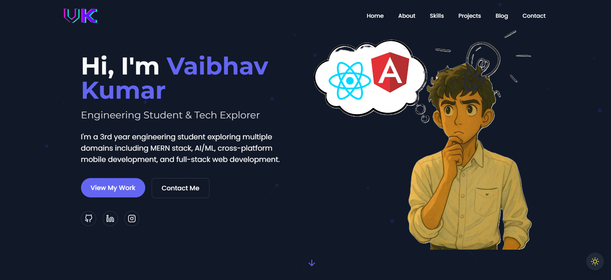
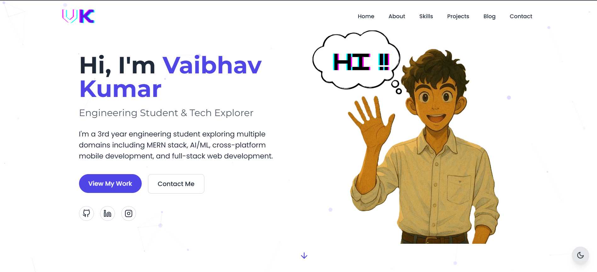

# 🚀 Vaibhav Kumar's Portfolio

<div align="center">
  
  
</div>

> A particle-powered, React-based portfolio showcasing my journey through tech! ✨

[](https://portfolio-vaibhavk121s-projects.vercel.app/)
[](https://github.com/Vaibhavk121/Portfolio)


## 🌟 Features

- 🎨 **Dynamic Particle Background** - Interactive particles that respond to your movement
- 🌓 **Dark/Light Theme** - Because we all have our preferred side of the Force
- 🎭 **Animated UI** - Smooth transitions powered by Framer Motion
- 🌐 **3D Tech Globe** - Interactive showcase of my tech stack using Three.js
- 📱 **Fully Responsive** - From tiny phones to huge monitors
- 📬 **Contact Form** - Powered by EmailJS for seamless communication
- ⚡ **Lightning Fast** - Built with Vite for optimal performance

## 🛠️ Built With

- **Frontend Framework**: React
- **Styling**: Tailwind CSS
- **Animations**: Framer Motion
- **3D Graphics**: Three.js & React Three Fiber
- **Email Service**: EmailJS
- **Build Tool**: Vite
- **Deployment**: [Your Deployment Platform]

## 🚀 Quick Start

1. **Clone the repository**
```bash
git clone https://github.com/Vaibhavk121/portfolio.git
```
2. Install dependencies
```bash
npm install
 ```

3. Set up environment variables
```bash
# Create a .env file and add:
VITE_EMAILJS_SERVICE_ID=your_service_id
VITE_EMAILJS_TEMPLATE_ID=your_template_id
VITE_EMAILJS_PUBLIC_KEY=your_public_key
 ```

4. Run the development server
```bash
npm run dev
```

5. Open your browser and visit h
4. Run the development server
```bash
npm run dev
```

## 🎯 Project Sections
- 🏠 Home - A warm welcome with particle animations
- 👨‍💻 About - My journey and quirky facts
- 🎯 Skills - Interactive 3D globe of technologies
- 🛠️ Projects - Showcase of my best work
- 📝 Blog - My hackathon experiences
- 📬 Contact - Get in touch!
## 📱 Featured Projects
1. DDOS.AI - AI-based DDoS Attack Detection System
2. Fearlessher - Community-based Women Safety App
3. Samskruhti-2k25 - College Cultural Fest Website
## 🤝 Connect With Me

<div >
  
[](https://portfolio-vaibhavk121s-projects.vercel.app/)
[](https://github.com/Vaibhavk121)
[](https://www.linkedin.com/in/vaibhav-kumar-b366872a6/)
[](https://www.instagram.com/vaibhav.k111)

</div>

### 📫 How to reach me:

- 💼 **LinkedIn**: Let's connect professionally on [LinkedIn](https://www.linkedin.com/in/vaibhav-kumar-b366872a6/)
- 📧 **Email**: Drop me a line at [vaibhavkumar2k24@gmail.com](mailto:vaibhavkumar2k24@gmail.com)
- 💻 **GitHub**: Check out my code on [GitHub](https://github.com/Vaibhavk121)
- 📸 **Instagram**: Follow my journey on [Instagram](https://www.instagram.com/vaibhav.k111)


## 📄 License
This project is open source and available under the MIT License .

Made with ❤️ using React, Tailwind & Framer Motion
